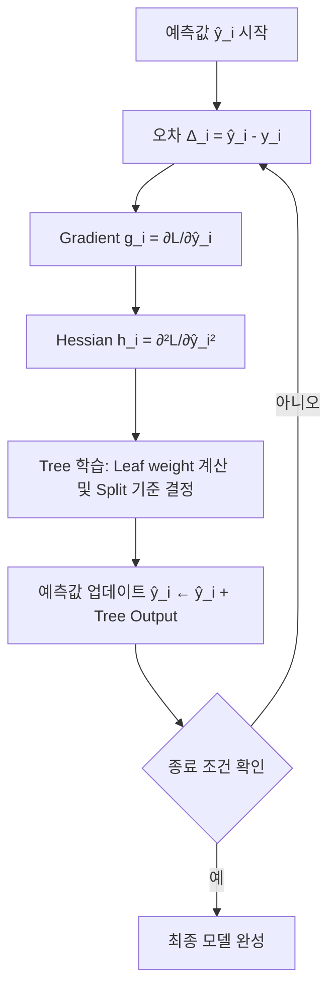

# LightGBM 학습 흐름 시각화 (Δ → Gradient → Hessian → Tree)

---

# 🎯 목표

> **Δ에서 시작해 Gradient, Hessian, Tree 학습까지의 흐름을 그림으로 직관적으로 이해**

---

# 1️⃣ 학습 단계 다이어그램

---

# 2️⃣ 단계별 설명

1. **Δ_i 계산**
   - 예측값과 실제값의 차이
   - 단순 오차 개념

2. **Gradient 계산 (g_i)**
   - Loss 기준에서 틀린 방향과 크기
   - Δ를 Loss 공간으로 확장

3. **Hessian 계산 (h_i)**
   - 수정 강도 조절, 안정성 확보

4. **Tree 학습**
   - Leaf weight = -Σg_i / (Σh_i + λ)
   - Split Gain = 1/2 [(Σg_L)^2/(Σh_L+λ) + (Σg_R)^2/(Σh_R+λ) - (Σg)^2/(Σh+λ)] - γ

5. **예측값 업데이트**
   - 트리 결과를 기존 예측값에 합산

6. **반복**
   - 종료 조건 (트리 수, 학습률 등) 만족 시 종료

---

# 3️⃣ 직관적 핵심 요약

- Δ → 단순 오차 확인
- Gradient → 방향과 크기 판단
- Hessian → 강도 안정화
- Tree → 패턴 학습 및 보정
- 반복 → 오차 최소화, 모델 최종 완성

> 이 그림을 보면 LightGBM 학습의 전체 흐름을 한 눈에 이해 가능

