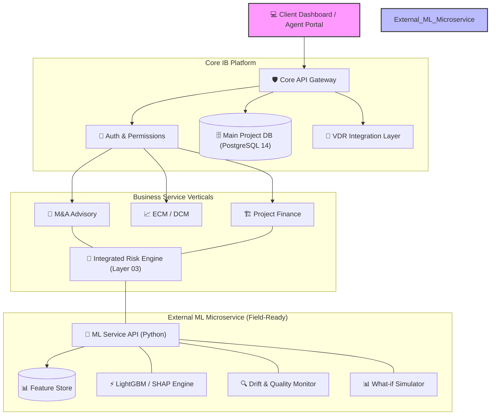

# [IB-ARC-01] 통합 IB/PF/M&A 시스템 아키텍처 사양서 (v1.2)

본 문서는 투자은행(IB)의 핵심 업무 영역인 **ECM/DCM, PF, M&A 자문**을 아우르는 통합 플랫폼의 기술적 구조와 운영 원칙을 정의합니다. 특히 **실무 가동성(Field-Ready)**을 담보하기 위해 **설명 가능성, 데이터 품질 모니터링, 그리고 신용도 기반 휴먼 리뷰(HITL)** 설계가 보완되었습니다.

---

## 1. 아키텍처 오버뷰 (The Big Picture)

본 시스템은 **"IB 플랫폼(Core Platform)"** 위에 다양한 **"비즈니스 서비스(Product Verticals)"**가 탑재되고, 전문적인 **"AI 분석 엔진(External ML Service)"**이 예측 기능을 제공하는 계층형 아키텍처(Layered Architecture)를 따릅니다.

---

## 2. 통합 딜 생애죽기 (Unified Deal Life Cycle)

모든 딜 유형(M&A, IPO, PF)은 다음의 통합된 워크플로우를 통해 관리됩니다.

1.  **발굴 및 수임 (Mandate)**: 딜 목표 및 대상 선정.
2.  **실사 및 데이터 수집 (DD & VDR)**: 가상 데이터룸(VDR) 연동을 통한 민감 문서 수집 및 권한 관리.
3.  **가치 평가 (Valuation)**: DCF, Comps 등을 이용한 가치 산정.
4.  **리스크 평가 및 시뮬레이션 (Risk & Simulation)**:
    - **Composite Engine**: 정량 스코어링(Layer 03) + **외부 ML 예측** 확률(Layer 04).
    - **What-if Scenario**: 심사역이 주요 입력을 변경하여 예상 리스크 변동 확인 가능.
5.  **전문가 검토 및 필터링 (Audit/HITL)**: AI 판단이 모호한 구간에서는 **자동으로 심사역 승인(Human-in-the-loop)** 단계로 전환.
6.  **계약 및 실행 (Closing)**: 자금 인출 및 딜 종결.

---

## 3. 핵심 아키텍처 결정 사항 (Core Decisions)

### ① 독립적 ML 마이크로서비스 (External ML Service)
- **독립성**: 인프라 부하 분리 및 모델 교체의 유연성 확보. Spring Boot(API)와 Python(ML) 간 gRPC/REST 통신.
- **피처 스토어(Feature Store)**: ML 서비스 내부에 최적화된 피처 데이터셋을 보유하여 학습-예측 간 **데이터 일관성** 확보.

### ② 의사결정 지원 및 휴먼 리뷰 (HITL Workflow)
현업 사용자가 시스템을 신뢰할 수 있도록, AI의 자의적 판단을 방지하는 **안전 장치(Safety Guardrail)**를 구축합니다.
- **Safe Zone**: 성공 확률 75% 이상 또는 25% 이하 → 자동 등급 분류 및 리포트 생성.
- **Gray Zone (45% ~ 55%)**: AI 판단의 정확도가 낮아지는 구간 → **'Human Review Required'** 상태로 즉시 변경 및 담당 심사역 알림 발송.

---

## 4. gstack 레이어 매핑 (Layered Mapping)

| gstack Layer | 명칭 (Name) | 통합 핵심 역할 (Unified Role) |
|:---:|---|---|
| **Layer 01** | **Concepts** | IB 플랫폼 정책 및 프로젝트 거버넌스 관리 |
| **Layer 02** | **Structures** | 개별 상품의 구조 정의 및 Waterfall 데이터 구축 |
| **Layer 03** | **Risk** | **Integrated Risk**: 정량 스코어링 + **HITL 휴먼 리뷰 워크플로우** |
| **Layer 04** | **Models** | **External ML**: 예측, **데이터 품질 감시(Drift)**, **자연어 설명 생성** |
| **Layer 05** | **Operations** | VDR 운영, Book Building 및 마켓 자금 클로징 |

---

## 5. 모니터링 및 실무 대응 전략

- **Drift Alert**: 데이터 분포 오차가 일정 수준을 넘어서면 개발팀 및 심사팀에 **재학습(Retraining) 필요 알림** 자동 발송.
- **Fallback 전략**: ML 마이크로서비스 에러 또는 Drift 경고 시, Layer 03의 **기본 금융 공학 기반(Rule-based)** 엔진으로 즉시 전환하여 시스템 가용성 유지.

---

> [!NOTE]
> 세부적인 기능적 계층 및 데이터 흐름은 [Integrated_IB_Platform_Functional_Hierarchy.md](file:///home/kbgkim/antigravity/projects/ib-risk-worktree/Formal_Specs/00_System_Architecture/Integrated_IB_Platform_Functional_Hierarchy.md)를 참조하십시오.
