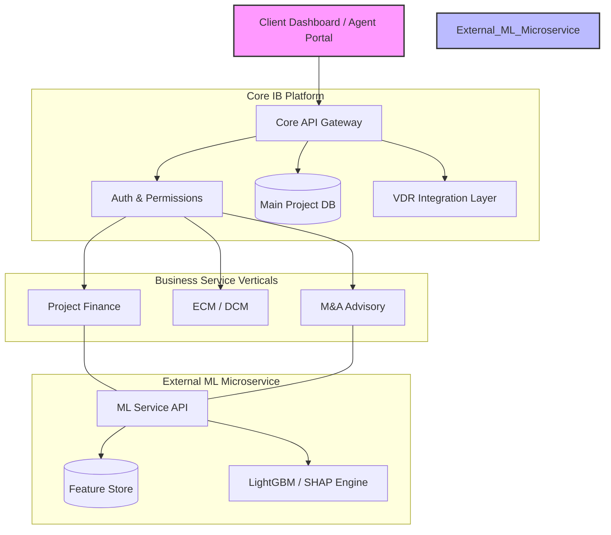

# [IB-ARC-00] 통합 IB/PF/M&A 시스템 아키텍처 사양서 (v1.0)

본 사원은 투자은행(IB)의 핵심 업무 영역인 **ECM/DCM, PF, M&A 자문**을 아우르는 통합 플랫폼의 기술적 구조와 운영 원칙을 정의합니다.

---

## 1. 아키텍처 오버뷰 (The Big Picture)

본 시스템은 **"IB 플랫폼(Core Platform)"** 위에 다양한 **"비즈니스 서비스(Product Verticals)"**가 탑재되고, 전문적인 **"AI 분석 엔진(External ML Service)"**이 예측 기능을 제공하는 계층형 아키텍처(Layered Architecture)를 따릅니다.

---

## 2. 통합 딜 생애주기 (Unified Deal Life Cycle)

모든 딜 유형(M&A, IPO, PF)은 다음의 통합된 워크플로우를 통해 관리됩니다.

1.  **발굴 및 수임 (Mandate)**: 딜 목표 및 대상 선정.
2.  **실사 및 데이터 수집 (Due Diligence & VDR)**: 
    - **M&A/PF**: 가상 데이터룸(VDR) 연동을 통해 민감 문서 수집 및 권한 관리.
3.  **가치 평가 (Valuation)**: DCF, Comps, Precedent Trans. 등을 이용한 가치 산정.
4.  **리스크 평가 (Risk Assessment)**:
    - **통합 엔진**: 정량적 스코어링 + **외부 ML 서비스**를 통한 부도/성공 확률 예측.
5.  **구조 설계 및 가격 결정 (Structuring & Pricing)**: 
    - **ECM/DCM**: Book Building을 통한 가격 결정.
    - **PF**: Waterfall 및 트랜치(Tranche) 설계.
6.  **계약 및 실행 (Closing)**: 자금 인출 및 딜 종결.

---

## 3. 핵심 아키텍처 결정 사항 (Core Decisions)

### ① 독립적 ML 마이크로서비스 (External ML Service)
- **독립성**: 인프라 부하 분리 및 모델 교체의 유연성 확보.
- **피처 스토어(Feature Store)**: 
    - **Data Independence**: ML 서비스 내부에 최적화된 피처 데이터셋을 보유하여 학습-예측 간 **데이터 일관성(Consistency)** 확보.
    - **Audit Trail**: 예측 시점의 데이터 이력을 보존하여 감사 가용성 증대.

### ② 보안: VDR 연동 (Virtual Data Room)
- **M&A 보안**: 민감 문서 관리를 위해 외부 VDR 솔루션(예: Ansarada, Datasite)과 API 연동.
- **자동 동기화**: 프로젝트 승인 주체별 문서 접근 권한(ACL) 자동 정합성 유지.

### ③ 데이터 모델 통합 (Integrated Data Model)
- **Entity**: `Company`, `Industry`, `Economic_Indicator` (공통 공유).
- **Transaction**: `Deal` (부모) -> `MA_Deal`, `PF_Deal`, `Capital_Deal` (자식 상속 구조).

---

## 4. 레이어별 매핑 (Mapping & Flow)

| gstack Layer | 명칭 (Name) | 통합 핵심 역할 (Unified Role) |
|---|---|---|
| **Layer 01** | **Concepts** | IB 플랫폼 정책 및 딜 수임 관리 |
| **Layer 02** | **Structures** | 개별 상품(PF, M&A)의 데이터 구조(Waterfall, Synergy) 정의 |
| **Layer 03** | **Risk** | 통합 스코어링 및 가이드라인 모니터링 |
| **Layer 04** | **Models** | **외부 ML 서비스**를 통한 AI 예측 가동 (LightGBM/SHAP) |
| **Layer 05** | **Operations** | Book Building, Pricing, VDR 운영 및 마켓 클로징 |

---

## 5. 결론 및 향후 과제

이제 본 시스템은 **'현업 가동 수준'**의 기술적 기반을 갖추었습니다. 다음 단계에서는 본 아키텍처에 따라 `Archive_Drafts`의 파편화된 리스크 모니터링(03) 및 AI 모델(04) 자료들을 정식 사양으로 정제하여 이식할 예정입니다.
