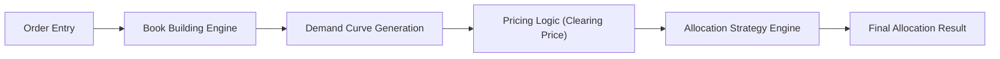

# [IB-DOC-C02] 북빌딩에서 배정까지의 프로세스 상세

본 사양서는 ECM/DCM(주식/채권 발행) 딜의 핵심 단계인 **Book Building(수요예측) → Pricing(가격결정) → Allocation(배정)**의 개념, 실무 흐름, 그리고 시스템 설계를 정의합니다.

---

## 1. 단계별 핵심 정의 (Stage Definitions)

| 단계 | 핵심 질문 | 최종 결과물 |
|:---:|---|---|
| **Book Building** | "누가, 얼마에, 얼마나 사고 싶어 하는가?" | **Order Book** (수요 집계표) |
| **Pricing** | "시장 수요를 반영한 최적 발행가는 얼마인가?" | **Final Price** (공모가/발행금리) |
| **Allocation** | "누구에게 얼마만큼의 물량을 배제할 것인가?" | **Allocation List** (배정 명부) |

---

## 2. 세부 프로세스 (Detailed Process)

### 2.1 Book Building (수요 예측)
기관 투자자들로부터 주문을 수집하여 **수요 곡선(Demand Curve)**을 형성하는 과정입니다.
- **입력 데이터**: Investor ID, Price (희망가), Quantity (수량), 주문 시각.
- **시스템 처리**: 가격대별 실시간 누적 수요 집계.

### 2.2 Pricing (가격 결정)
수집된 Order Book을 분석하여 총 발행 물량을 소화할 수 있는 **결정 가격(Clearing Price)**을 산정합니다.
- **참고 지표**: Oversubscription Ratio(청약 경쟁률), VWAP, 가치평가 결과.

### 2.3 Allocation (물량 배정)
확정된 발행가를 기준으로 투자자별 배정 물량을 확정합니다.
- **배정 방식**: 
    - **비례 배정(Pro-rata)**: 주문량에 비례하여 균등 배분.
    - **차등 배정(Discretionary)**: 기관의 품질(Long-only 여부), 기여도 등을 고려한 전략적 배분.

---

## 3. 데이터 및 이벤트 흐름 (Data & Event Flow)

---

## 4. 핵심 상태 전환 (State Machine)

1.  `BOOK_BUILDING_OPEN`: 주문 수신 가능 상태.
2.  `BOOK_BUILDING_CLOSED`: 주문 마감 및 집계 고정.
3.  `PRICING_FINALIZED`: 발행가 확정.
4.  `ALLOCATION_COMPLETED`: 배정 명부 확정 및 공시 준비.

---

> [!TIP]
> **실무 포인트**: Allocation 시, 단순 비율보다는 투자자의 과거 행태(FLipping 여부 등)를 반영한 **점수제 배정**이 선호됩니다. 세부 알고리즘은 [Allocation_Strategy_Engine_Spec.md](file:///home/kbgkim/antigravity/projects/ib-risk-worktree/Formal_Specs/03_Risk_Engines/Allocation_Strategy_Engine_Spec.md)를 참조하십시오.
