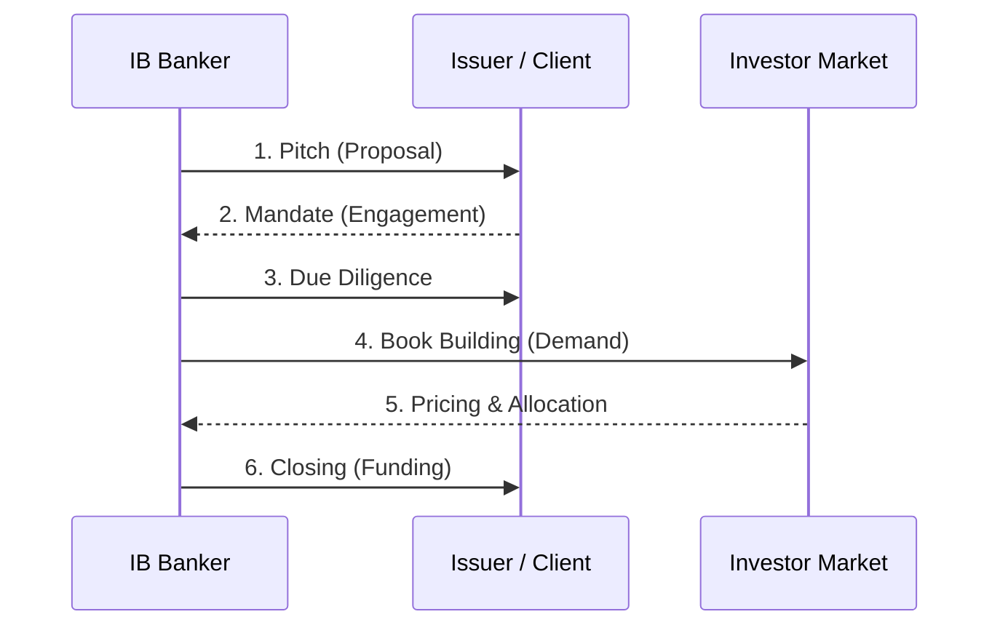

# [IB-DOC-C01] IB 딜 생애주기: Pitch에서 Closing까지

본 사양서는 투자은행(IB)의 일반적인 딜 수임 및 집행 프로세스를 3단계 핵심 마일스톤(Pitch, Mandate, Closing)을 중심으로 정의합니다.

---

## 1. 단계별 핵심 정의 (Key Stages)

### 1.1 Pitch (제안 단계)
- **정의**: 잠재 고객에게 딜 구조를 제안하고 주관사로 선정되기 위한 경쟁 단계.
- **핵심 활동**: Teaser 제작, 가치 평가(Valuation) 초안, 딜 구조(Structure) 제안.
- **산출물**: Pitch Book (제안서).

### 1.2 Mandate (수임 단계)
- **정의**: 고객으로부터 공식적으로 딜 주관 업무를 위임받는 단계.
- **핵심 활동**: 금융자문계약(Mandate Letter) 체결, 실사(Due Diligence) 개시.
- **산출물**: Mandate Letter, Engagement Letter.

### 1.3 Execution & Closing (집행 및 종결)
- **정의**: 실사를 완료하고 자금을 조달(Pricing/Allocation)하여 딜을 최종 완료하는 단계.
- **핵심 활동**: Book Building, Pricing, Allocation, 법적 문서 체결, 자금 인출.
- **산출물**: Closing Memo, Settlement Report.

---

## 2. 통합 워크플로우 (Integrated Workflow)

---

## 3. 실무 고려 사항 (Field Notes)

- **HITL (Human-in-the-Loop)**: Mandate에서 Closing으로 넘어가는 시점에 리스크 심사팀의 최종 승인이 필수적입니다.
- **Data Continuity**: Pitch 단계에서 사용된 기초 데이터는 Closing 단계의 리스크 시뮬레이션까지 일관되게 유지되어야 합니다.
