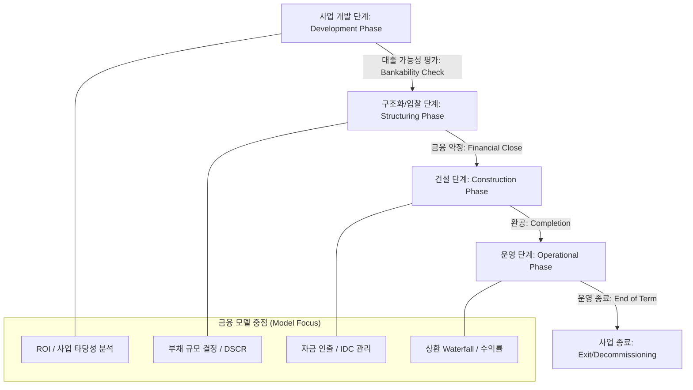
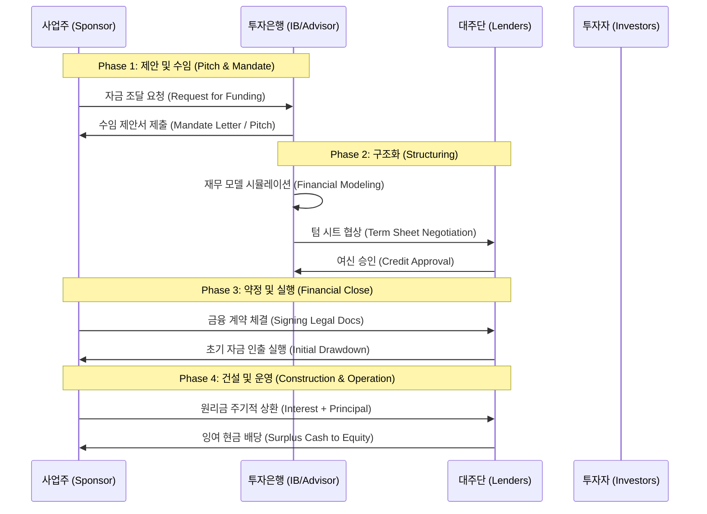

# [IB-DOM-01] IB 도메인 표준 사양서 (Domain Standard Specification v1.0)

본 문서는 투자은행(IB) 업무, 특히 프로젝트 파이낸싱(Project Finance: PF)의 공식적인 도메인 영역 및 생애주기를 정의하며, 시스템 구축의 기본 개념적 토대(Conceptual Foundation) 역할을 합니다.

---

## 1. 도메인 정의 (Domain Definition)

**IB (Investment Banking)**는 자금이 필요한 기업체(Corporate Entity)와 수익을 추구하는 투자자(Investor) 사이의 자본 흐름을 설계하는 전략적 아키텍처입니다.

### 핵심 이해관계자 (Core Actors)
| 참여자 (Actor) | 역할 (Role) | 책임 (Responsibilities) |
|---|---|---|
| **사업주 (Sponsor)** | 프로젝트 소유자 | 프로젝트 초기 제안, 자본금(Equity) 제공 및 운영 관리 |
| **대주단 (Lenders/IB)** | 자본 공급자 | 대출 구조화(Debt Structuring), 가용성/상기성 리스크 평가 및 현금흐름 모니터링 |
| **투자자 (Investors)** | 리스크 테이커 | 메자닌(Mezzanine) 또는 전략적 지분 투자를 통한 고수익 추구 |
| **SPC/SPV (Special Purpose Vehicle)** | 법적 엔진 | 프로젝트의 자산과 부채를 기업과 분리하여 보유하는 서류상 회사 |

---

## 2. 프로젝트 파이낸싱(PF) 생애주기 (Lifecycle)

PF 생애주기는 5가지 주요 단계로 구분되며, 각 단계별로 재무 시뮬레이션 엔진에 요구되는 사항이 다릅니다.

### 단계별 상세 설명

#### ① 사업 개발 단계 (Development Stage: Pre-Bankability)
- **목표**: 프로젝트가 타당한 수익성을 확보하여 원리금을 상환할 수 있는지 평가.
- **주요 지표**: IRR, NPV, 초기 차입 규모 산정.

#### ② 구조화 및 금융 약정 (Structuring & Financial Close)
- **목표**: 자본 구조(Debt:Equity Ratio) 확정.
- **리스크 관리**: 금융 약정(Covenants) 설정 (예: 최소 DSCR > 1.2x 유지).

#### ③ 건설 단계 (Construction Phase: Drawdown Period)
- **목표**: 자금 부족(Funding Gap) 방지 및 건설 중 이자(IDC) 관리.
- **메커니즘**: 공정률에 따른 월별 자금 인출(Drawdown) 관리.

#### ④ 운영 단계 (Operation Phase: Stable Cash Flow)
- **목표**: 안정적인 부채 상환 및 주주 배당.
- **메커니즘**: 상환 우선순위(Cash Flow Waterfall) 엄격 집행.

---

## 3. 비즈니스 프로세스 흐름도 (Swimlane Diagram)

주요 이해관계자 간의 거래 및 상호작용을 다음과 같이 시각화합니다.

---

## 4. 전략적 위치 (Strategic Position)

본 상위 도메인 표준(Purified Layer)은 향후 구현될 모든 데이터 테이블(Level 02) 및 알고리즘(Level 04)이 본 문서에서 정의된 각 단계 및 주체의 책임과 직접 매핑되도록 보장합니다.
