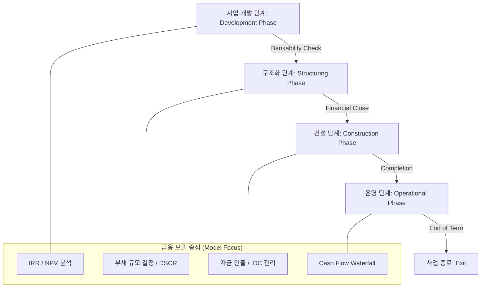
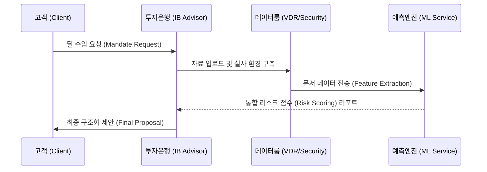

# [IB-DOM-01] IB 도메인 표준 사양서 (Domain Standard Specification v1.1)

본 문서는 투자은행(IB) 업무인 **자금 조달(ECM/DCM/PF)** 및 **인수합병 자문(M&A Advisory)**의 공식적인 도메인 영역 및 생애주기를 정의하며, 시스템 구축의 기본 개념적 토대(Conceptual Foundation) 역할을 합니다.

---

## 1. 도메인 정의 (Domain Definition)

**IB (Investment Banking)**는 자금이 필요한 **기업체 (Corporate Entity)**와 수익을 추구하는 **투자자 (Investor)** 사이의 자본 흐름을 설계하는 전략적 아키텍처입니다.

### 1.1 핵심 이해관계자 (Core Actors)
| 참여자 (Actor) | 역할 (Role) | 책임 (Responsibilities) |
|---|---|---|
| **사업주 (Sponsor/Client)** | 프로젝트/거래 소유자 | 초기 제안, **자본금 (Equity)** 제공 및 의사결정 |
| **투자은행 (IB/Advisor)** | 구조화 및 자문 | **금융 구조화 (Financial Structuring)**, 실사 관리 및 자금 조달 주선 |
| **대주단 (Lenders)** | 자본 공급자 | **대출 (Debt)** 제공, 리스크 평가 및 현금흐름 모니터링 |
| **전략적 투자자 (SI)** | 사업 시너지 추구 | 경영권 확보 또는 사업적 협력을 목적으로 하는 투자자 |
| **재무적 투자자 (FI)** | 수익률 극대화 추구 | PEF(사모펀드) 등 순수 투자 수익을 목적으로 하는 투자자 |
| **자문가 그룹 (Advisors)** | 전문 영역 지원 | **FAS (Financial Advisory Services)**, 회계법인(Tax/Audit), 법무법인(Legal) |
| **SPC/SPV** | 법적 엔진 | 프로젝트의 자산과 부채를 기업과 분리하여 보유하는 서류상 회사 |

> [!NOTE]
> **[Business-Only] IB 실무 지식**
> IB는 단순히 돈을 빌려주는 것이 아니라, **리스크를 분산(Risk Mitigation)**하고 **자본 효율성(Capital Efficiency)**을 극대화하는 '금융 공학'의 영역입니다. 특히 PF에서는 비소구 금융(Non-Recourse) 특징을 이해하는 것이 개발 환경의 상환 Waterfall 로직을 이해하는 핵심입니다.

---

## 2. 프로젝트 파이낸싱 (Project Finance: PF) 생애주기

PF는 특정 프로젝트의 미래 현금흐름을 담보로 자금을 조달하는 금융 기법입니다.

### 2.1 PF Lifecycle & Model Focus

> [!TIP]
> **필수 용어 가이드**
> - **DSCR (Debt Service Coverage Ratio)**: 원리금상환계수. Cash flow가 빚을 갚기에 충분한지 나타내는 지표.
> - **Covenants (금융 약정)**: 대주단이 요구하는 재무적/비재무적 준수 사항. 위반 시 **EOD (Event of Default)** 발생.

---

## 3. 인수합병 자문 (M&A Advisory) 생애주기

M&A는 기업의 경영권을 매수(Buy-side)하거나 매도(Sell-side)하는 전체 과정을 의미합니다.

### 3.1 M&A Workflow
1. **티저 및 비밀유지약정 (Teaser & NDA)**: 잠재 인수자에게 간략한 정보 제공 및 **비밀유지약정 (Non-Disclosure Agreement)** 체결.
2. **정보이용설명서 (IM: Information Memorandum)**: 대상 회사의 상세 재무/사업 내용이 담긴 문서 제공.
3. **예비 입찰 및 실사 (Preliminary Bid & Due Diligence)**: 인수의향서 제출 후 **가상 데이터룸 (VDR)**을 통한 정밀 **실사 (Due Diligence)** 진행.
4. **본입찰 및 계약 (Binding Offer & SPA)**: 최종 가격 제안 및 **주식매매계약 (SPA: Share Purchase Agreement)** 체결.
5. **딜 종결 (Closing)**: 자금 납입 및 주식 인도를 통한 거래 종료.

> [!IMPORTANT]
> **[Business-Only] M&A 실무 포인트**
> M&A 리스크 산출 시 **Representations & Warranties (진술 및 보장)** 조항의 강도를 파악하는 것이 중요합니다. 이는 잠재적 우발 채무(Contingent Liabilities)에 대한 책임 소재를 결정하기 때문입니다.

---

## 4. 통합 비즈니스 시퀀스 도표

---

## 5. 전략적 위치 (Strategic Position)

본 도메인 표준은 시스템의 모든 데이터 테이블 및 알고리즘이 실제 금융 현장의 용어 및 프로세스와 정합성을 유지하도록 보장합니다. 개발자는 본 문서의 **[Business-Only]** 섹션을 통해 데이터 필드의 비즈니스적 의미를 깊이 있게 파악할 수 있습니다.
