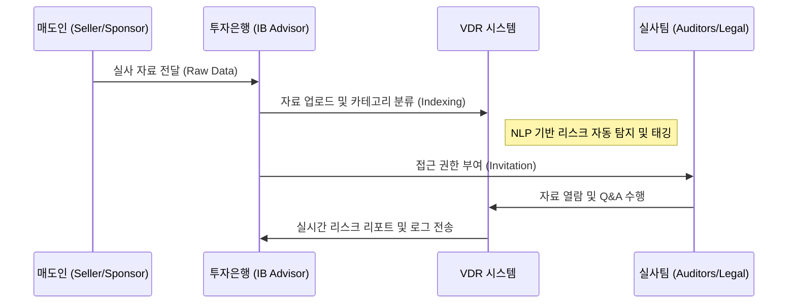

# [IB-DOM-03] M&A 및 VDR 프로세스 흐름 (MA & VDR Process Flow)

본 문서는 **인수합병 자문 (M&A Advisory)** 활동의 핵심 도구인 **가상 데이터룸 (VDR: Virtual Data Room)**의 운영 프로세스와 보안 정책을 정의합니다.

---

## 1. VDR 기반 실사 워크플로우 (DD Workflow)

실사(Due Diligence) 과정은 문서의 업로드, 분석, 보안 제어, 보고의 순서로 진행됩니다.

### 1.1 통합 프로세스 시퀀스 도표

### 1.2 상세 단계별 정의
1. **업로드 및 인덱싱 (Upload & Indexing)**: 매도 측 자료를 VDR로 업로드. 대량 업로드 시 **OCR 및 자동 분류 엔진** 작동.
2. **리스크 탐지 (Risk Detection)**: AI/ML 기반으로 계약서 내 **독소 조항 (Poison Pills)** 또는 리스크 요인(Change of Control 등) 자동 탐지.
3. **Q&A 관리**: 실사팀의 질문과 매도인의 답변 과정을 플랫폼 내에서 트래킹하여 기록 유지.
4. **리포트 발행 (Report Generation)**: 실사 완료 후 발견된 위험 요인을 종합하여 **실사 요약 보고서 (DD Summary)** 자동 생성.

---

## 2. 보안 정책 및 거버넌스 (Security & Governance)

금융 거래에서 데이터 보안은 최우선 순위입니다.

### 2.1 접근 제어 (Access Control)
- **RBAC (Role-Based Access Control)**: 사용자 역할(매도측, 매수측, 자문사)에 따른 조회/다운로드/인쇄 권한 차등 부여.
- **워터마킹 (Dynamic Watermarking)**: 모든 열람 문서에 사용자 정보 및 IP를 포함한 워터마크 강제 삽입.

### 2.2 [Business-Only] 실무 보안 가이드
- **Black-out (블랙아웃) 기능**: 특정 민감 정보(개인정보 등)를 가리는 마스킹 기능.
- **Audit Trail (감사 로그)**: 누가, 언제, 어떤 문서를 얼마나 오래 열람했는지 초 단위로 기록하여 유출 사고 시 증거로 활용.

---

## 3. 리스크 탐지 지표와 VDR 연동

보안 레이어에서 탐지된 이상 징후는 **Layer 03: Risk** 점수에 즉시 반영됩니다.

| 리스크 요인 (Risk Factor) | 비즈니스 감점 기준 | 비고 |
|---|---|---|
| **비정상 다운로드** | 대량 다운로드 시 보안 점수 50% 감점 | 유출 시도 의심 |
| **미인가 시간 접근** | 야간/주말 접근 시 가중치 부여 | 보안 위반 가능성 |
| **민감 키워드 노출** | 'Top Secret', 'Internal' 문서 공유 시 | 정보 보안 등급 위반 |

---

## 4. [Business-Only] Q&A 통합 관리 (Q&A Management)

실무에서 가장 번거로운 **Q&A 세션**을 자동화합니다.
- **Auto-Routing**: 질문 분야(Tax, Legal 등)에 따라 해당 담당자에게 자동으로 할당.
- **FAQ 연동**: 유사한 질문이 들어올 경우 기존 답변 후보를 미리 제안하여 대응 시간 단축.

> [!TIP]
> **개발자 구현 참고 사항**
> VDR 시스템은 대량의 비정형 데이터(PDF, Excel)를 처리하므로, 성능 최적화와 병렬 처리(Async Processing)가 매우 중요합니다.
