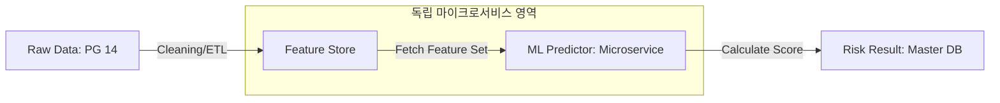

# [IB-DOM-04] ML 및 피처 스토어 데이터 개념 가이드 (ML & Feature Store Conceptual Guide)

본 문서는 **비즈니스 로우 데이터 (Raw Data)**가 어떻게 **ML 예측 엔진**의 입력값으로 변환되는지, 그리고 **피처 스토어 (Feature Store)**가 독립 마이크로서비스 환경에서 어떤 역할을 수행하는지 정의합니다.

---

## 1. 데이터 생애주기 및 아키텍처 (Data Lifecycle)

비즈니스 데이터는 다단계 변환 과정을 거쳐 고해상도 리스크 예측값으로 재탄생합니다.

### 1.1 데이터 흐름 개념도

### 1.2 단계별 데이터 정의
1. **Raw Business Data (원천 데이터)**: 고객사 재무제표, VDR 문서 텍스트, 계약 로그 등 PostgreSQL 14에 저장된 정제되지 않은 데이터.
2. **Feature Engineering (피처 엔지니어링)**: 비즈니스 데이터를 수치형(0.12, 1.5x 등) 또는 범주형(High, Low) 데이터로 정규화하는 과정.
3. **Feature Storage (피처 저장)**: 모델 학습 및 추론에 즉각 사용될 수 있도록 최적화된 형태로 보관하는 **피처 스토어**.
4. **ML Inference (추론)**: 학습된 딥러닝 모델이 피처를 입력받아 확률 기반의 **부도 가능성 (Probability of Default)** 또는 **거래 실패 위험도** 산출.

---

## 2. [Business-Only] 피처 정의 및 비즈니스 매핑

현업에서 중요하게 생각하는 지표가 ML 모델의 **주요 피처 (Key Features)**로 매핑됩니다.

| 비즈니스 지표 (Business KPIs) | ML 피처 명칭 (Feature IDs) | 비즈니스적 중요도 |
|---|---|---|
| **EBITDA 성장률** | `f_ebitda_growth_3y` | 기업의 실질 현금흐름 창출력 |
| **소송 가액 비율** | `f_litigation_ratio` | 법적 리스크의 재무적 파급력 |
| **문서 열람 편차** | `f_vdr_anomaly_score` | 정보 유출 및 보안 위협 징후 |

---

## 3. 독립 ML 마이크로서비스 연동 (Integration)

메인 앱과 ML 서비스는 낮은 결합도(Loose Coupling)를 유지합니다.

### 3.1 연동 규격 (Interface)
- **통신 방식 (Protocol)**: 대량 데이터의 빠른 전송을 위해 **gRPC**를 기본으로 하며, 범용성을 위해 **REST API**를 병행합니다.
- **데이터 독립성 (Data Independence)**: ML 서비스는 메인 DB에 직접 쿼리하지 않으며, 오직 **피처 스토어** API를 통해서만 데이터를 송수신합니다.

### 3.2 [Business-Only] 모델 재학습 및 보정 (Retraining & Calibration)
- **Model Drift (모델 성능 저하)**: 시장 상황(금리 급등 등) 시 기존 모델의 예측력이 떨어질 경우, 최신 데이터를 사용하여 **자동 재학습 (Automated Retraining)** 수행.
- **Manual Override (수동 보정)**: 기계의 예측 점수가 현업의 판단과 상충할 경우, 관리자가 **수동 보정 (Manual Calibration)**을 통해 최종 리스크 등급을 조정할 수 있는 거버넌스 제공.

---

## 4. [Technical Note] 개발 고려 사항

- **Latency (지연 시간)**: 실시간 리스크 평가 요청 시 피처 조회부터 예측 결과 반환까지 500ms 이내 보장 필요.
- **Data Versioning**: 모델 학습 시점의 피처 값을 보존하여 향후 동일한 예측 결과가 재현 가능한지 검증 가능해야 함.
