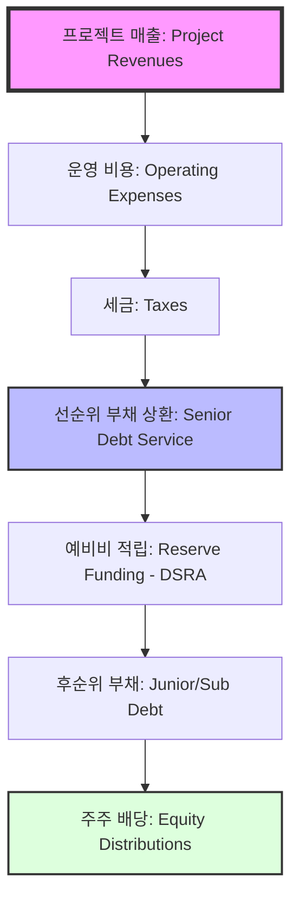

# [IB-STR-02] PF 현금흐름 및 자본 구조 사양서 (Financial Spec v1.0)

본 사양서는 프로젝트 파이낸싱(Project Finance: PF) 재무 모델의 공식적인 구조적 규칙을 정의하며, 특히 **현금흐름 Waterfall(우선순위)**과 **고급 상환 역량 지표(Coverage Metrics)**에 초점을 맞춥니다.

---

## 1. 현금흐름 우선순위 (Cash Flow Waterfall Hierarchy)

프로젝트 파이낸싱은 법적/계약적으로 강제된 엄격한 지급 우선순위(Priority of Payments)에 의해 운영됩니다. 상위 계층(Tier)이 완전히 충족되기 전까지는 하위 계층으로 단 1원도 흐를 수 없습니다.



### 상환 계층별 상세 규칙 (Payment Tiers)

| 우선순위 | 계층 (Tier) | 내용 (Content) | 핵심 규칙 (Core Rule) |
|---|---|---|---|
| **1순위** | **운영 비용 (OpEx)** | 유지보수비, 인건비, 보험료 | 자산이 계속 가동될 수 있도록 유지 (최우선) |
| **2순위** | **세금 (Taxes)** | 법인세 및 국세 | 법적 소송 및 압류 방지 |
| **3순위** | **선순위 부채** | 원리금 상환 (Principal + Interest) | 대주단에 대한 의무 상환 |
| **4순위** | **예비비 (Reserves)** | DSRA (Debt Service Reserve) | 미래의 상환 불능 상황을 대비한 버퍼(Buffer) |
| **5순위** | **주주 배당 (Equity)** | 스폰서 배당 (Dividends) | **잔여 이익 수취자(Residual Claimant)** - 마지막에 지급 |

---

## 2. 고급 상환 역량 지표 (Advanced Coverage Metrics)

PF 분석 시 당기 수익뿐만 아니라, 대출 기간 전반의 복원력(Resilience)을 평가하기 위해 다음의 **생애주기 상환 비율(Life Coverage Ratios)**을 사용합니다.

### ① DSCR (Debt Service Coverage Ratio): 당기 원리금 상환 비율
- **평가 기간**: 현재 분기/반기/연도 (Periodic).
- **공식**: `CFADS / (당기 예정 원금 + 이자)`
- **평가**: 통상 `> 1.20x` 이상을 안정권으로 간주.

### ② LLCR (Loan Life Coverage Ratio): 대출 전 기간 상환 비율
- **평가 기간**: **현재**부터 대출 **만기(Maturity)** 시점까지.
- **공식**: `대출 기간 현금흐름(CFADS)의 현재가치 / 미상환 대출 잔액`
- **목적**: 대출 기간 전체의 현금 유입 총량이 부채를 갚기에 충분한지 평가.

### ③ PLCR (Project Life Coverage Ratio): 프로젝트 전 기간 상환 비율
- **평가 기간**: **현재**부터 **프로젝트 종료** 시점까지.
- **공식**: `프로젝트 생애 총 현금흐름(CFADS)의 현재가치 / 미상환 대출 잔액`
- **목적**: 대출 기간 이후의 잔여 가치를 포함하여 리스크 완충력(Value Cushion)을 측정.

---

## 3. 알고리즘 아키텍처 (Pseudocode Logic)

```python
# 현금흐름 Waterfall 처리 로직 예시

def process_period_waterfall(revenue, inputs):
    # 단계 1: 순 현금흐름 산출 (Net Revenue)
    cash_pool = revenue - (inputs.opex + inputs.taxes)
    
    # 단계 2: 선순위 부채 상환 (Senior Debt)
    remaining_cash, debt_paid = pay_debt(cash_pool, inputs.debt_service)
    
    # 단계 3: 예비비 적립 (Reserve Check)
    final_cash, dsgra_funding = fund_reserve(remaining_cash, inputs.target_reserve)
    
    # 단계 4: 주주 배당 (Equity Dividend)
    total_equity_dividend = final_cash if final_cash > 0 else 0
    
    return {
        "debt_service": debt_paid,
        "equity_yield": total_equity_dividend,
        "dscr": cash_pool / inputs.debt_service
    }
```

---

## 4. 시각화 요구사항 (Visualization)

시스템의 주요 출력물은 각 기간별 **계층식 상진(Cascade/Bucket Diagram)**이어야 하며, 각 "버킷(Bucket)"이 채워지는 정도를 직관적으로 보여주어야 합니다.

> [!NOTE]
> 만약 특정 기간에 선순위 부채(Senior Debt) 버킷이 가득 차지 않을 경우, 이는 **기한의 이익 상실(Default Event)** 또는 **금융 약정 위반(Breach of Covenant)** 사유가 됩니다.
