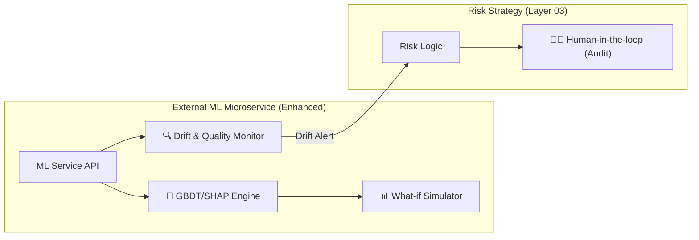

# [Analysis] 현업 요구사항 기반 아키텍처 보완 및 수정 제언 보고서

기존 아카이브(`Archive_Drafts`) 분석 결과, 금융 현업에서 특히 중요하게 여기는 **설명 가능성, 안정성, 운영 품질** 관점에서 현재 아키텍처를 보완할 수 있는 4가지 핵심 요소를 도출했습니다.

---

## 1. 현업 페인 포인트 및 요구사항 분석

| 구분 | 주요 요구사항/문제점 | 아키텍처 반영 현황 | 보완 필요 사항 |
|---|---|---|---|
| **설명 가능성** | "왜 이 딜이 위험한가?"에 대한 규제 및 현업 설득 필요 | SHAP 엔진 도입 (반영됨) | SHAP 결과의 **자연어 요약(NLG)** 기능 추가 |
| **모델 안정성** | 노이즈 데이터에 의한 과적합(Overfitting) 및 오판 우려 | Hessian 기반 학습 (이론적 반영) | **Confidence Score(신뢰도 점수)** 기반 휴먼 리뷰 연동 |
| **품질 모니터링** | 시간 경과에 따른 데이터 분포 변화(Drift)로 인한 모델 성능 저하 | 미비 | **Feature Drift Collector** 및 재학습 트리거 설계 |
| **실무 시뮬레이션** | "주요 지표가 변할 때 리스크가 어떻게 변하는가?" 확인 요구 | 미비 | **Stress Test (What-if) API** 엔드포인트 설계 |

---

## 2. 아키텍처 보완 제언 (Refinements)

### ① 데이터 품질 및 드리프트 모니터링 레이어 추가
- **요구사항**: 모델 배포 후에도 데이터의 정합성과 분포 변화를 실시간 감지해야 함.
- **반영 계획**: `External ML Microservice` 내부에 **'Data Drift Monitor'** 컴포넌트 추가 설계.

### ② Intelligent Fallback: 신뢰도 기반 워크플로우
- **요구사항**: AI의 판단이 모호한 구간(예: 45%~55%)에서는 시스템이 확답을 내리지 말고 전문가 검토를 유도해야 함.
- **반영 계획**: 리스크 엔진(Layer 03)에서 AI 결과값의 '신뢰 구간'을 판단하여 **'Audit Required'** 상태를 자동 리턴하도록 로직 보완.

### ③ Stress Test (What-if) 시뮬레이션 인터페이스
- **요구사항**: 심사역이 특정 변수(예: LTV, DSCR)를 임의로 조정하여 리스크 변화를 사전에 시뮬레이션하고 싶어 함.
- **반영 계획**: `RiskController`에 `/api/v1/risk/simulate` 엔드포인트 정의 및 ML 모델 호출 연동.

---

## 3. 수정된 시스템 아키텍처 다이어그램 (부분)

---

## 🏁 최종 제언

> [!IMPORTANT]
> **"단순 예측을 넘어 의사결정 지원 시스템으로"**
> 현재 아키텍처는 기술적 구현에는 완벽하나, 현업 사용자가 시스템의 판단을 신뢰하고 도구로서 활용하기 위해서는 **1) 모니터링, 2) 시뮬레이션, 3) 신뢰도 기반 수동 개입** 레이어가 명시적으로 포함되어야 합니다.

위 보완 사항들을 `아키텍처 사양서.md`에 최종 반영하여 **'실무 대응형 아키텍처(Field-Ready Architecture)'**로 업그레이드할 것을 제안합니다.
