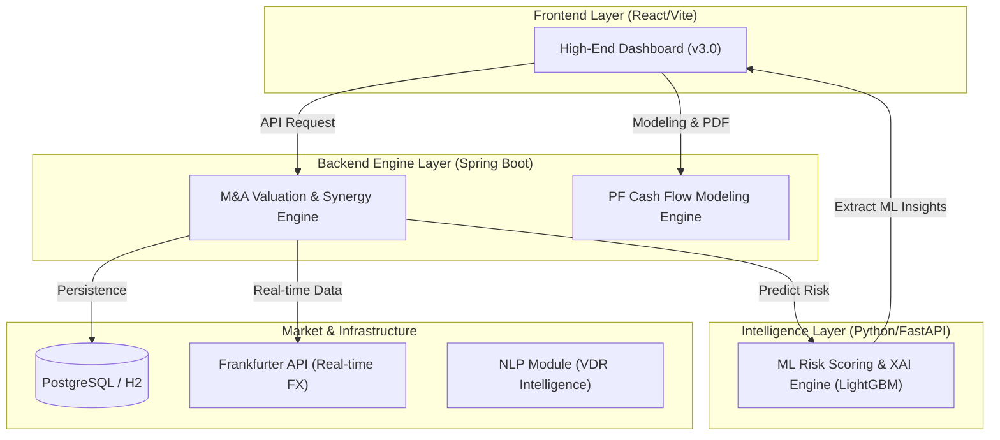

# IB Unified Platform: Premium Intelligence Terminal (v9.5)

**IB Unified Platform**은 투자은행(Investment Banking) 및 프로젝트 파이낸싱(Project Finance) 도메인 학습용으로 구축된 고도의 지능형 시뮬레이션 및 관제 터미널입니다.

본 플랫폼은 M&A 밸류에이션, PF 현금흐름 모델링, 실시간 글로벌 리스크 전파, AI 기반 자동 헤징 전략 등 실제 금융 실무에서 다루는 복잡한 데이터와 시나리오를 통합적인 관점에서 학습하고 시뮬레이션할 수 있도록 설계되었습니다.

---

## 🧪 Development Notes (개발 배경 및 환경)

본 프로젝트는 **Vibe Coding 기반 개발 방식**을 통해 구현되었습니다.
초기 설계 이후 총 **3차례의 주요 요구사항 확장(Iteration)**이 이루어졌으며, 약 **1주일 내 집중 개발**을 통해 완성되었습니다.

개발은 **Antigravity Pro 구독 환경**을 기반으로 진행되었으며, 다음과 같은 특징을 가집니다:

### 📌 개발 환경

* OS: Windows 10
* Runtime: WSL Ubuntu 22.04
* Hardware: **16GB RAM 저사양 노트북**

### ⚙️ 개발 방식

* Antigravity 기반 AI Assisted Development
* Superpowers, GStack 등 플러그인을 활용한 **개인화 개발 하네스(Harness) 구축**
* 반복적인 요구사항 확장 + 실시간 아키텍처 개선 중심의 Vibe Coding

### ⚠️ 개발 중 이슈 및 한계

* 프로젝트 후반부 **Antigravity 빈번한 크래시 발생**
* `run command` 기능 간헐적 먹통 현상
* 로컬 시스템 자원 한계(16GB RAM)로 일부 작업 지연

➡️ 그럼에도 불구하고, 플러그인 조합 및 하네스 최적화를 통해 **전체 시스템 완성**

---

## 🏗️ 시스템 아키텍처 (Detailed Architecture)

본 시스템은 마이크로서비스 지향적 멀티 레이어 아키텍처를 기반으로 하며, 각 모듈은 고유의 전문적인 금융 엔진을 탑재하고 있습니다.

---

## 🚀 주요 모듈 및 기능 (Core Modules & Features)

### 1. M&A Valuation Engine (`ib-mna-engine`)
- **Interactive Probability Bridge**: 3개 시나리오(Bear, Base, Bull)별 가중치 조절 및 실시간 NPV 연동 브릿지 시각화.
- **Synergy Analysis**: 비용/매출 시너지 실시간 주입 및 가치 변동 시뮬레이션.
- **Deep Dive**: [M&A 엔진 설계서](file:///home/kbgkim/antigravity/projects/ib/docs/Phase01_03_Platform_Integration_DeepDive.md)

### 2. Project Finance Engine (`ib-pf-engine`)
- **Cash Flow Waterfall**: 복잡한 대출 상환 및 배당 구조의 완벽한 모델링.
- **Financial Ratios**: DSCR, LLCR, PLCR 등 핵심 금융 지표 실시간 산출.
- **Tornado Sensitivity**: 주요 변수(Capex, OpEx, Revenue) 20% 변동에 따른 평균 DSCR 민감도 분석.
- **Deep Dive**: [PF 엔진 설계서](file:///home/kbgkim/antigravity/projects/ib/docs/Phase08_09_Valuation_Risk_Engagement_DeepDive.md)

### 3. Global Risk Monitor (`Global Asset Control`)
- **Risk Propagation System**: 자율 주행 지도 기반의 전 세계 자산 상태 실시간 모니터링 및 리스크 전파 시뮬레이션.
- **Intelligent Auto-Hedging**: 리스크 임계점 도달 시 FX 스왑, CDS, 대출 금리 조정 등 전략 자동 추천 및 실행.
- **Deep Dive**: [글로벌 리버넌스 상세](file:///home/kbgkim/antigravity/projects/ib/docs/Phase15_Global_Risk_Propagation_DeepDive.md)

### 4. Machine Learning & Intelligence (`ib-ml-engine`)
- **GBDT-based Scoring**: LightGBM 모델을 통한 실시간 리스크 확률 예측.
- **XAI Support**: 리스크 점수의 핵심 기여 요인을 추출하여 의사결정의 투명성 확보.
- **Deep Dive**: [ML 모델 아키텍처](file:///home/kbgkim/antigravity/projects/ib/docs/ML_Model_Architecture_Rationale.md)

---

## 📚 관련 문서 (Documentation)

- **[사용자 매뉴얼 (User Manual)](./docs/USER_MANUAL.md)**: 비즈니스 관점의 기능 가이드 및 화면별 설명.
- **[운영자 매뉴얼 (Admin Manual)](./docs/ADMIN_MANUAL.md)**: 기술 아키텍처, 설치 및 배포 구동 가이드.
- **[전체 문서 색인 (Documentation Index)](./docs/DOCUMENTATION_INDEX.md)**: Phase 1부터 18까지의 상세 설계 기록.

---

## 🛠️ 기술 스택 (Tech Stack)

- **Frontend**: React 18, Vite, Framer Motion, Recharts, Lucide, react-simple-maps.
- **Backend**: Spring Boot 3.x, Spring Data JPA, OpenPDF (Reporting).
- **ML/Analytics**: Python 3.9+, FastAPI, LightGBM, SHAP, Scikit-learn.
- **Infrastructure**: Gradle 7.x, PostgreSQL / H2 (Development).

---

## ⚖️ 면책 사항 (Disclaimer)

본 플랫폼은 **학습 및 연구용 알고리즘 시뮬레이션 목적**으로 제작되었습니다. 시스템에서 제공되는 모든 가치 산정 및 리스크 지표는 입력된 가상의 데이터와 알고리즘 결과물이며, 실제 투자 자문이나 금융 결정 용도로 사용될 수 없습니다.

---
> Last Updated: 2026-04-04 | Maintainer: BongGeon KIm
