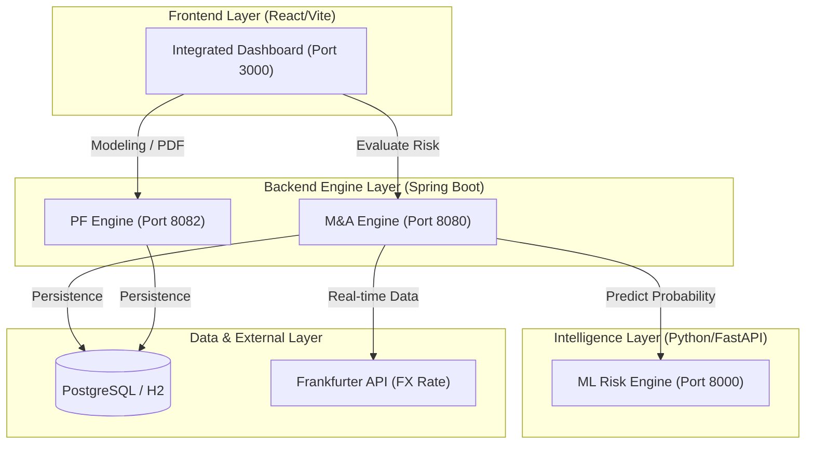

# IB 통합 플랫폼 운영자 매뉴얼 (Administrator/Operator Manual)

본 문서는 IB 통합 플랫폼의 백엔드 엔진, 프론트엔드 대시보드, 그리고 ML 예측 엔진의 기술적 구조와 운영 방법을 상세히 설명합니다.

---

## 1. 시스템 아키텍처 (System Architecture)

본 플랫폼은 마이크로서비스 지향적 멀티 모듈 아키텍처를 채택하고 있으며, 각 서비스는 독립적으로 구동되거나 REST API를 통해 상호작용합니다.



---

## 2. 개발 및 운영 환경 구축 (Setup & Installation)

### 2.1 요구 사항
- **Java**: 17 이상
- **Node.js**: 18 이상 (NPM 포함)
- **Python**: 3.9 이상
- **Build Tool**: Gradle 7.x 이상

### 2.2 초기 설정 (Alias 활용)
프로젝트 전용 환경 변수와 관리 명령을 활성화하기 위해 아래 명령을 실행합니다.
```bash
# IB 환경 활성화
aib  # 또는 source ./bin/ib_env
```

---

## 3. 서비스 구동 및 관리 (Service Management)

`aib` 환경이 로드된 상태에서 아래의 단축 명령어를 사용하여 서비스를 통합 관리할 수 있습니다.

### 3.1 통합 관리 명령어
| 기능 | 단축어 | 실제 명령어 |
| :--- | :--- | :--- |
| **전체 서비스 시작** | `ir` | `irun a` |
| **전체 서비스 종료** | `is` | `istop a` |
| **현재 상태 확인** | `ist` | `ists` |
| **실시간 로그 확인** | `il` | `ilog a` |

### 3.2 개별 모듈 수동 실행
- **백엔드 (M&A)**: `./gradlew :ib-mna-engine:bootRun` (Port 8080)
- **PF 엔진 (Finance)**: `./gradlew :ib-pf-engine:bootRun` (Port 8082)
- **ML 엔진 (Python)**: `source venv/bin/activate && uvicorn app.main:app --port 8000`
- **프론트엔드 (React)**: `npm run dev -- --port 3000`

---

## 4. 핵심 모듈별 상세 기술 사양 (Technical Specs)

### 4.1 M&A Valuation Engine (`ib-mna-engine`)
- **Persistence**: JPA/Hibernate를 활용하며, 개발 환경에서는 H2, 운영 환경에서는 PostgreSQL을 사용합니다.
- **Security**: AOP 기반의 감사 로깅(`SystemGovernanceAspect`)이 적용되어 모든 주요 자산 실행 내역을 기록합니다.
- **External API**: `MarketDataService`를 통해 Frankfurter API에서 실시간 환율을 동적으로 수집합니다.

### 4.2 Project Finance Engine (`ib-pf-engine`)
- **Modeling**: 현금흐름 폭포(Cash Flow Waterfall) 및 DSCR/LLCR 산출 로직이 포함되어 있습니다.
- **Reporting**: `OpenPDF` 라이브러리를 사용하여 분석 결과를 전문적인 PDF 리포트로 렌더링합니다.

### 4.3 ML Risk Engine (`ib-ml-engine`)
- **Algorithm**: `LightGBM` GBDT 모델을 사용하여 리스크 점수를 예측합니다.
- **XAI**: SHAP 기반의 특성 중요도를 추출하여 리스크 요인을 대시보드에 시각화합니다.

---

## 5. 트러블슈팅 (Troubleshooting)

### 5.1 포트 충돌 (Port Conflict)
특정 포트가 이미 사용 중인 경우 아래 명령으로 강제 종료할 수 있습니다.
```bash
fuser -k 8080/tcp  # M&A Backend
fuser -k 8082/tcp  # PF Engine
fuser -k 8000/tcp  # ML Engine
fuser -k 3000/tcp  # Frontend
```

### 5.2 Python 가상환경 문제
ML 엔진 실행 전 가상환경(`venv`)이 생성되어 있고 활성화되었는지 확인하십시오. 
```bash
cd ib-ml-engine && python -m venv venv && source venv/bin/activate && pip install -r requirements.txt
```

---

## 6. 보안 및 거버넌스 (Security & Governance)

- **VDR Access Log**: 모든 문서 접근 로그는 보안 등급 산출을 위해 실시간으로 가공되어 저장됩니다.
- **Audit Trail**: `/api/v1/governance/audits` 엔드포인트를 통해 시스템 내 모든 위험 전파 및 헤징 실행 로그를 모니터링할 수 있습니다.

---

> Last Updated: 2026-04-03 | Status: 🏆 Final Admin Version
