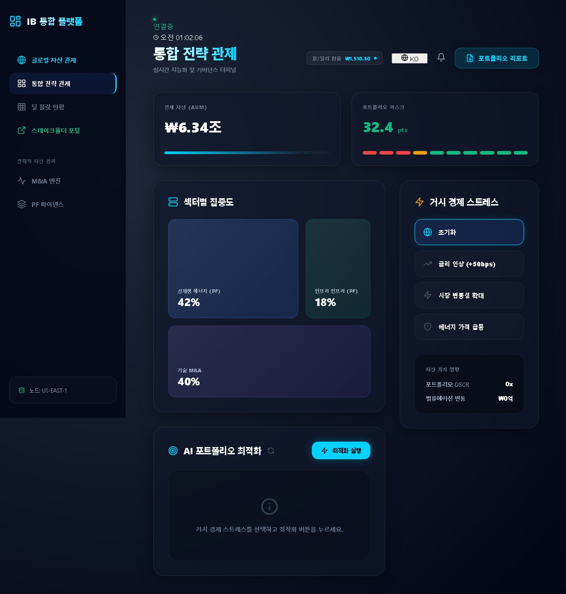
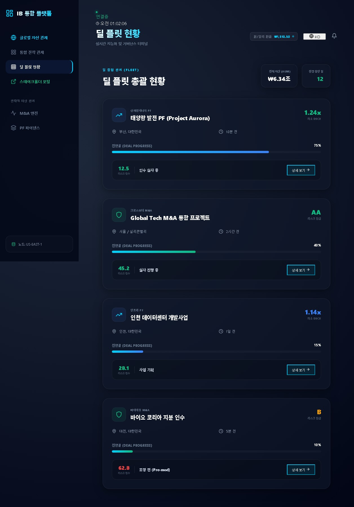
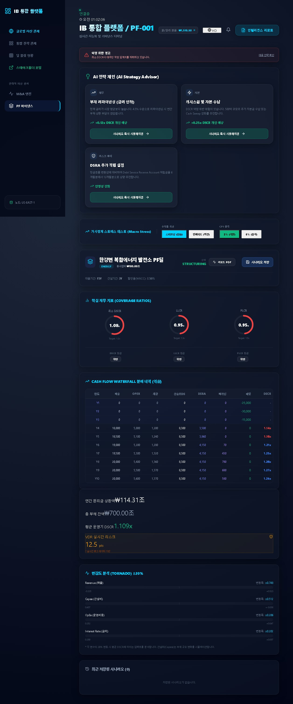
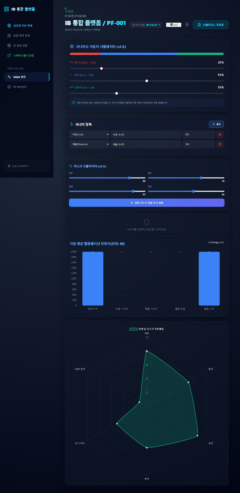
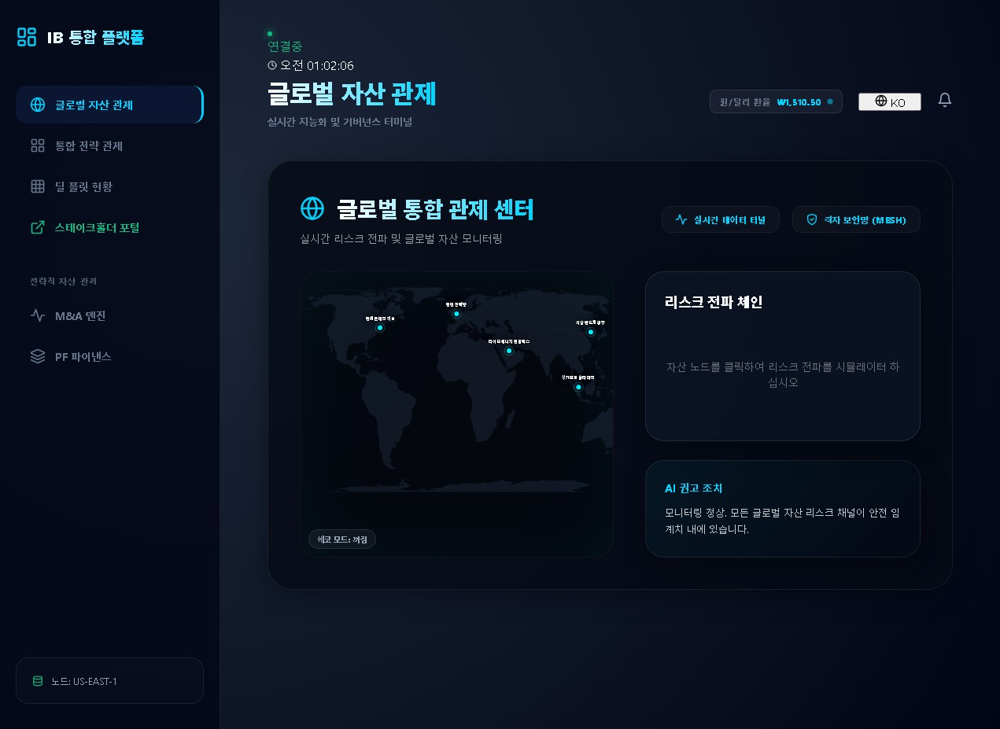
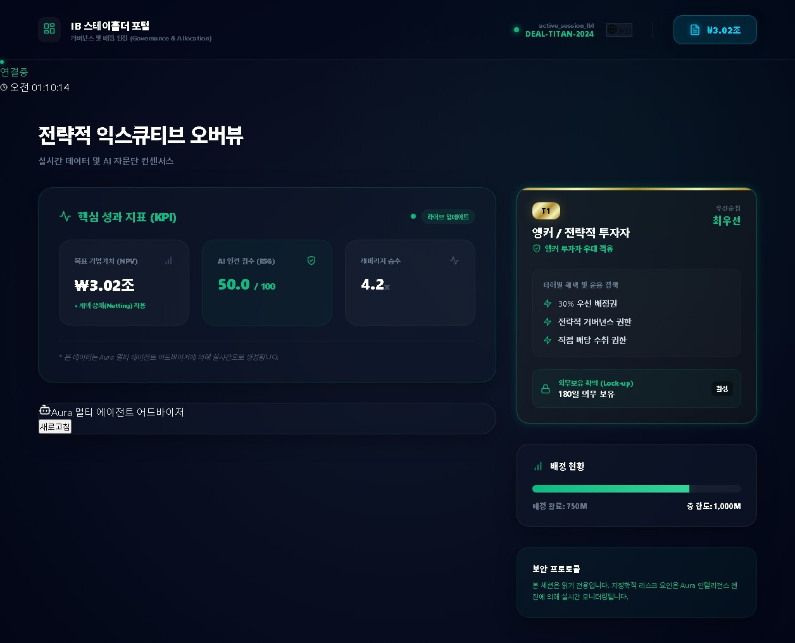

# IB 통합 플랫폼 사용자 매뉴얼 (User Manual)

본 매뉴얼은 IB 통합 플랫폼의 주요 화면별 기능과 비즈니스 활용 방법을 상세히 설명합니다. 본 플랫폼은 투자은행(IB) 및 프로젝트 파이낸싱(PF) 업무 프로세스를 학습하고 시뮬레이션하기 위한 도구입니다.

---

## 1. 개요 및 접속 (Overview & Access)

IB 통합 플랫폼은 고도의 보안 환경을 시뮬레이션하며, 첫 접속 시 고액 자산가 전용 보안 스캔 애니메이션과 함께 시작됩니다. 메인 대시보드에서는 전체 포트폴리오의 리스크 상태와 핵심 지표를 한눈에 확인할 수 있습니다.

- **대표 화면**:
  > 

---

## 2. 주요 화면별 가이드 (Feature Guide)

### 2.1 딜 플릿 총괄 현황 (Deal Fleet Overview)
포트폴리오에 포함된 모든 프로젝트(딜)의 진행 상태와 리스크 등급을 관리하는 화면입니다.

- **핵심 기능**:
    - **AUM(자산규모) 모니터링**: 실시간 환율이 반영된 전체 자산 가치 확인.
    - **딜 진행률 (Deal Progress)**: 각 프로젝트의 현재 단계(Due Diligence, Planning 등) 시각화.
    - **리스크 등급**: Safe, Warning, Caution, Breach 등 4단계 리스크 분류.
- **이미지 가이드**:
  > 

---

### 2.2 PF 상세 분석 대시보드 (Project Finance Dashboard)
개별 프로젝트의 현금흐름(Cash Flow)과 채무 상환 능력을 정밀 분석하는 화면입니다.

- **핵심 지표 설명**:
    - **DSCR (Debt Service Coverage Ratio)**: 영업 현금흐름으로 원리금을 상환할 수 있는 배수. (통상 1.15x 이상 유지 권장)
    - **LLCR (Loan Life Coverage Ratio)**: 대출 전 기간의 현금흐름 가방용 현금(CFADS)의 현재가치를 잔여 부채로 나눈 비율.
- **분석 도구**:
    - **Tornado Sensitivity Analysis**: Capex, OpEx, 매출 변동 시 평균 DSCR에 미치는 임팩트 시각화.
    - **Scenario Snapshot**: 현재 시뮬레이션 결과를 저장하거나 과거 기록을 로드하여 비교 분석.
- **이미지 가이드**:
  > 

---

### 2.3 M&A 밸류에이션 엔진 (M&A Valuation Engine)
인수 금융 및 시너지 분석을 위한 정밀 가치 산정 도구입니다.

- **핵심 기능**:
    - **Interactive Probability Bridge**: Bear/Base/Bull 시나리오별 가중치를 조절하여 가중 평균 기업가치(NPV) 산출.
    - **Synergy Input Module**: 비용/매출 시너지 항목을 실시간으로 추가하여 통합 가치 변동 확인.
    - **Valuation Waterfall Chart**: 현재 가치에서 시너지 및 비용 반영을 거쳐 최종 가치에 이르는 과정을 시각화.
- **이미지 가이드**:
  > 

---

### 2.4 글로벌 자산 관제 센터 (Global Risk Monitor)
전 세계에 분산된 자산의 지정학적 리스크 및 운영 리스크를 실시간 관제하는 화면입니다.

- **핵심 기능**:
    - **Risk Propagation Chain**: 특정 자산에 충격(Shock) 발생 시, 상호 의존 관계에 있는 다른 자산으로 리스크가 전파되는 과정을 시뮬레이션.
    - **Intelligent Auto-Hedging**: AI 어드바이저가 리스크 완화를 위해 FX 스왑, CDS 등 최적의 헤징 전략을 추천하며, 센티넬 모드 활성화 시 자동 실행.
- **이미지 가이드**:
  > 

---

### 2.5 스테이크홀더 포털 및 AI 어드바이저 (Stakeholder Portal & Aura)
투자자 및 이해관계자에게 제공되는 전용 뷰어와 AI 전략 제언 모듈입니다.

- **Aura AI Advisor**: 법률, 재무, 운영 전문가 에이전트들의 합의 과정을 거친 최종 전략 권고안을 실시간 제공.
- **PDF Report**: 분석된 모든 데이터를 전문적인 투자 보고서 형태로 즉시 생성 및 다운로드.
- **이미지 가이드**:
  > 

---

## 3. 비즈니스 용어 및 메트릭 해설 (Glossary)

| 용어 | 설명 | 비고 |
| :--- | :--- | :--- |
| **NPV** | Net Present Value (순현재가치) | 현금흐름의 현재가치 합계 |
| **WACC** | Weighted Average Cost of Capital | 가중 평균 자본 비용 (할인율) |
| **VaR** | Value at Risk | 특정 신뢰 수준에서의 최대 예상 손실 |
| **Hedging** | 헤징 | 위험 회피를 위해 반대 방향의 거래를 체결하는 행위 |
| **Covenant** | 약정 | 대출 계약 시 차주가 준수해야 하는 재무적 의무 사항 |

---

> [!TIP]
> **더 상세한 기술적 배경이 궁금하신가요?**
> - 시스템의 아키텍처와 설치 방법은 [운영자 매뉴얼](../docs/ADMIN_MANUAL.md)을 참고하세요.
> - 기능별 상세 설계 논리는 [상세 설계 문서(Deep Dive)](../docs/DOCUMENTATION_INDEX.md)에서 확인할 수 있습니다.

---
> Last Updated: 2026-04-03 | Maintainer: BongGeon KIm
