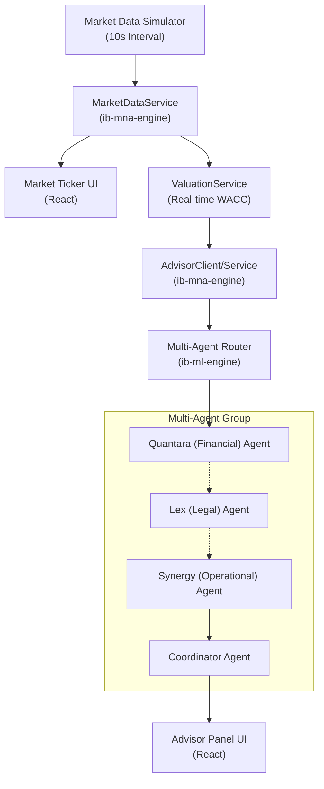

# [Detailed Report] Phase 6: 실시간 데이터 피드 및 멀티 에이전트 협업 구현 완료

**작성일**: 2026-03-31 | **문서 버전**: v1.1 (High-Detail) | **진행 상태**: 구현 및 검증 완료

---

## 1. 개요 (Executive Summary)

IB 플랫폼 Phase 6 작업은 **"맥박(Pulse)"**과 **"두뇌(Brain)"**의 통합을 목표로 진행되었습니다. 실시간 시장 지표를 수집하고, 이를 3명의 전문 AI 에이전트(Lex, Quantara, Synergy)가 서로 교차 검증하여 전략적 권고안을 도출하는 지능형 시스템을 구축하였습니다. 이 문서는 학습 및 업무 습득을 목적으로 설계부터 구현, 검증까지의 모든 과정을 상세히 기록합니다.

---

## 2. 시스템 아키텍처 (System Architecture)



---

## 3. 핵심 모듈별 상세 설명 (Core Implementation Details)

### 3.1 Market Feed (The Pulse)
실시간 시장의 변화를 감지하고 시스템에 주입하는 레이어입니다.

*   **`MarketDataService` (Java)**:
    *   **동적 시뮬레이터**: 유료 API(Bloomberg 등)를 대체하기 위해 10초마다 금리, 환율, 신용 스프레드 등을 무작위 변동(Random Walk with Trend) 시키는 스케줄러를 포함합니다.
    *   **공유 메모리**: `AtomicReference`를 사용하여 여러 서비스(Valuation, Advisor)가 최신 시장 데이터를 스레드 세이프하게 참조하게 합니다.
*   **`ValuationService` 연동**:
    *   기존 하드코딩된 WACC(10%)를 제거하고, **(US 10Y Yield + 5% Equity Risk Premium)** 공식을 적용하여 시장 금리 변화에 따른 NPV를 실시간으로 재산출합니다.

### 3.2 Multi-Agent Advisor (The Brain)
`ib-ml-engine` 내부에 구축된 전문가 그룹의 협업 로직입니다.

| 전문가 (Agent) | 페르소나 및 주력 분야 | 주요 로직 (Logic) |
| :--- | :--- | :--- |
| **Quantara** | 재무 전략가 & 퀀트 (Financial) | 금리/스프레드 변동에 따른 자본 조달 비용 및 수익성 민감도 분석. |
| **Lex** | 시니어 법률 고문 (Legal) | 탄소 배출권 가격에 따른 ESG 규제 리스크 및 약정(Covenant) 준수 여부 검토. |
| **Synergy** | 운영/공급망 전문가 (Operational) | 유가/원자재가 상승에 따른 매출원가(COGS) 및 CAPEX 초과 위험 진단. |

*   **하이브리드 합의(Hybrid Consensus) 메커니즘**:
    1.  **Quantara**가 가장 먼저 재무적 파급력을 분석합니다.
    2.  **Lex**와 **Synergy**는 Quantara의 의견을 '참조'하여, 재무적 상황(예: 리파이낸싱 필요성)이 자기 분야의 리스크(예: 계약 검토, 설비 교체)에 어떤 도미노 효과를 일으키는지 기술합니다.
    3.  **Coordinator**가 이 모든 상충될 수 있는 의견을 조율하여 최종 전략 요약을 작성합니다.

---

## 4. UI/UX 디자인 요소 (UI Components)

*   **Market Ticker**:
    *   다크 모드 배경에 유리 효과(Backdrop Blur)를 적용한 스티키 바(Sticky Bar)입니다.
    *   상승/하락 기호와 네온 컬러 하이라이트를 통해 시장의 급박함을 시각화합니다.
*   **Advisor Panel**:
    *   각 전문가의 페르소나를 담은 카드형 인터페이스입니다.
    *   `lucide-react` 아이콘(Shield, TrendingUp, Zap)을 활용하여 직관성을 높였습니다.

---

## 5. 검증 및 업무 활용 가이드 (How to Verify & Use)

### 5.1 시나리오 테스트 케이스
1.  **금리 급등 시나리오**: `MarketDataService`에서 시뮬레이션된 금리가 4.5%를 넘을 때, 대시보드의 NPV가 즉각 하락하며 **Quantara**가 "HIGH RISK" 경고를 내놓는지 확인합니다.
2.  **리스크 도미노 확인**: 재무 전문가의 금리 경고에 대해, **Lex**가 "리파이낸싱 계약 검토 필요"라는 추가 의견을 내놓는지 확인하여 에이전트 간의 교차 검증 로직을 검증합니다.

### 5.2 실행 명령어 (Verification Commands)
```bash
ir  # 전체 서비스(M&A, ML, UI) 통합 시작 (단축어)
il  # 통합 로그 모니터링
```

---

## 6. 결론 (Conclusion)

Phase 6 구현을 통해 IB 플랫폼은 **"데이터 수집 -> 엔진 계산 -> 리스크 판단 -> 전략 고안"**에 이르는 전체 지능형 파이프라인을 완성하였습니다. 이 문서는 향후 신규 전문가 에이전트를 추가하거나 실제 유료 데이터 API를 연동할 때 핵심 가이드라인으로 활용됩니다.
